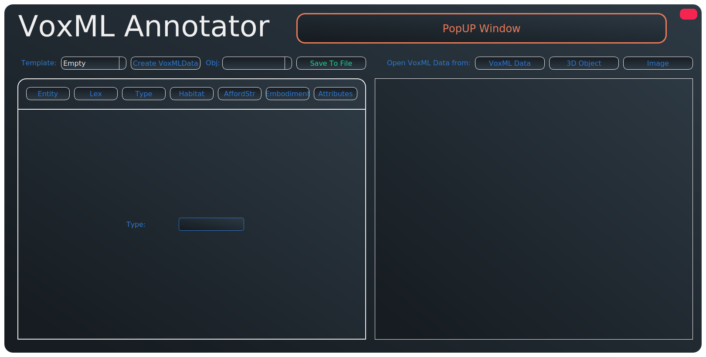

# Text2Scene - VoxML Framework

Based on [VoxML](https://arxiv.org/abs/1610.01508) data representation.

A python tool to read, write and analyse VoxML data. Create VoxML data based on templates or create entirely new objects. Read and classify 3D-objects and images and modify their VoxML representation.

Based on old project: [TTLabVoxMLANnotator](https://github.com/texttechnologylab/TTLabVoxMLAnnotator).


### Course Information

This is my repository for Text2Scene: a course offered at Goethe Universität Frankfurt am Main in Wintersemester 2021/2022.

Main exercise of the module consisting of writing a VoxML-Annotator in python using PyQt5.

## Usage

### Dependencies

* PyQt5
* torch
* trimesh
* pyvista
* pyvistaqt
* transformers
* timm

```
pip install -r requirements.txt
```

### How to use

```
python3 main.py
```

A GUI should open:



### GUI Description

* Left box: View and modify the currently selected VoxML data
* Right box: View the 3D model or image from the currently selected VoxML object if available
* Above left box: Create new VoxML Data - switch between objects - save object to file
* Above right box: Import VoxML files, 3D-Objects or Images